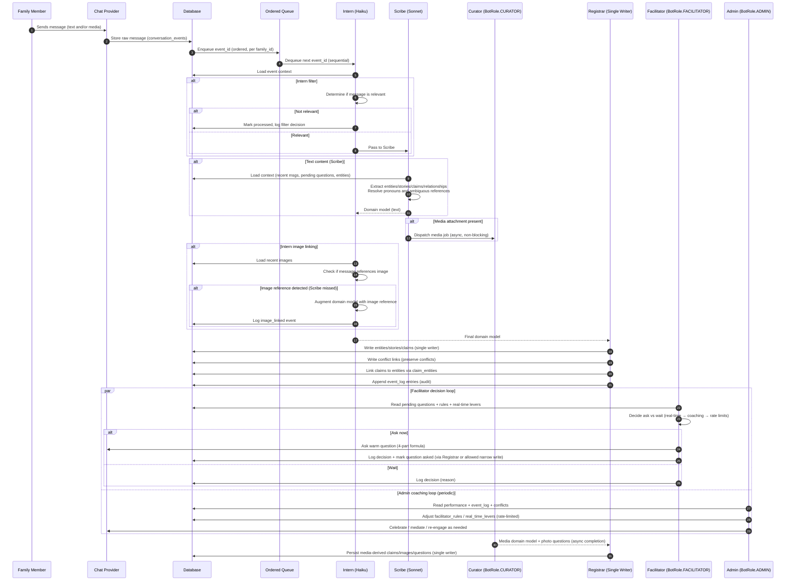

# System Architecture

## Quick Reference

**Core Roles (Internal Names):**

- `BotRole.FACILITATOR` - Asks questions
- `BotRole.ADMIN` - Manages project
- `BotRole.SCRIBE` - Extracts data
- `BotRole.CURATOR` - Analyzes photos (hidden)
- `BotRole.REGISTRAR` - Persists data to database (hidden)

**Default Names For "Public" Agents (Configurable):**

- Facilitator: "Carmencita"
- Admin: "La Directora"
- Scribe: "Don Rubén"

---

## Data Flow

Every row that represents family data MUST be scoped by family_id.
Every query MUST filter by family_id.
Deduplication MUST be done within family_id only.

family_id is the primary isolation boundary of the system.

```
Chat Message
      │
      ├──→ Queue → Events Table → Intern (filter) → Scribe → Intern (image link) → Registrar → Database
      │                              │                                    │
      │                              └─ skips irrelevant msgs ────────────┘
      │                                                                   │
      │                                                      (augments domain model if
      │                                                       Scribe missed image refs)
      │
      └──→ Live Stream
           ├──→ Admin (contains internal coaching module, celebrations, mediation)
           └──→ Facilitator (activity tracking)
                    ↑
                    │
              Coaching Module
              (monitors & adjusts in real-time)
```

**Processing Pipeline:**

1. **Intern (filter)** - Uses Haiku to quickly determine if message is relevant for extraction
2. **Scribe** - Uses Sonnet to extract entities, claims, and relationships from relevant messages
3. **Intern (image link)** - Uses Haiku to detect if message references a recent image (catches what Scribe missed)
4. **Registrar** - Persists domain model to database (pure TypeScript, no LLM)

Ordering rule: Text messages are processed sequentially and in order (context-sensitive). Media enrichments (Curator outputs) are asynchronous and may arrive later; when they do, they generate additional domain-model outputs and questions without reordering the text stream.

---

## Sequence Diagram



## Key Architectural Decisions

### 1. Configurable Library (Not Single-Family App)

- Internal: Generic role names (`BotRole.FACILITATOR`)
- Configuration: Display names ("Carmencita", "Annie", "Yui")
- Reusable across cultures and languages

### 2. Bilingual+ Storage

Every text stored in 3 forms:

- `content_original` - Exact words (sacred)
- `content_{primary}` - Primary language version
- `content_{secondary}` - Secondary language version

### 3. Claims-Based Data Model

Instead of storing facts directly, store **claims**:

```sql
CREATE TABLE claims (
  id UUID,
  claim_type VARCHAR(50),
  subject VARCHAR(255),
  claim_value JSONB,
  source_message_id UUID,
  claimed_by VARCHAR(255),
  confidence VARCHAR(20),
  conflicts_with UUID[],
  status VARCHAR(20)
);
```

Benefits:

- Clear provenance
- Easy conflict detection
- Multiple claims about same thing
- Audit trail

#### Claims and Entity Resolution

**Entity merge tracking** via `entity_merges` table:

- Records when entities are merged (e.g., "Maria G." → "Maria Garcia")
- Tracks merge strategy (`fuzzy_match`, `identity_claim`, `manual`, `llm_resolved`)
- Deletable to undo merges (provenance preserved in claims)
- Denormalized `superseded_by` columns on entity tables for query performance

**Claim-entity relationships** via `claim_entities` join table:

- Many-to-many: Claims can reference multiple entities
- Bidirectional: Efficient "show all claims about Maria" queries
- Role metadata: `subject`, `related`, `location`, `witness`
- Identity resolution support: `resolved`, `entity_merge_id` fields

**Query helper `get_entity_merge_chain()`:**

- Finds all predecessors of an entity (entities that were merged into it)
- Enables "all claims about Maria including claims originally about merged predecessors"
- Ensures consistency even if denormalized columns temporarily out of sync

**Service extraction pattern:**

- `EntityMatcherService` - Entity deduplication with fuzzy matching
- `ConflictDetectorService` - Detects contradicting claims
- `StrengthCalculatorService` - Hybrid scoring (algorithmic + LLM)
- `MergeHandlerService` - Entity merge operations
- `DataRetrieverService` - Shared data retrieval patterns

See [ADR-025](adr/025-claims-based-data-architecture.md) for detailed architecture decision and [SERVICES.md](SERVICES.md) for service layer patterns.

### 4. Coaching Module with Real-Time Levers

**Two-tier control system:**

**Static Rules (User Config):**

- Bot personalities
- Initial engagement phase

**Dynamic Rules (Coach Adjusts):**

- Question frequency (1-5 per window)
- Wait times (12-72 hours)
- Coaching signals (hold_back/neutral/jump_in)

**Real-Time Levers (Immediate Response):**

- `activeConversationCooldown` - Prevent interruptions
- `sensitiveTopicCooldown` - Space after grief/trauma
- `emotionalKeywords` - Trigger detection
- `contextCheckMessageCount` - How much to review
- `skipIfAnsweredRecently` - Avoid redundancy

### 5. Single Writer Pattern

ONLY Registrar modifies core tables:

- Prevents race conditions
- Ensures data integrity
- Clear audit trail
- Transaction management

### 6. Web3 Integration Hook

Optional Solana integration:

- Write content hashes to blockchain
- Tamper-proof audit trail
- Verify data integrity
- Configurable (on/off)

### 7. Event Log

Complete audit trail:

```sql
CREATE TABLE event_log (
  id UUID,
  timestamp TIMESTAMP,
  event_type VARCHAR(50),
  actor VARCHAR(255),
  event_data JSONB
);
```

#### LLM Evaluation Queue

**Async processing for uncertain claims:**

The system uses a dedicated `llm_evaluation_queue` table for selective LLM evaluation of complex or uncertain claims, rather than processing every claim through expensive LLM calls.

**Queue structure:**

- Priority-based (0-100, high-stakes claims get priority 100)
- Multiple evaluation types: `claim_strength`, `entity_match`, `conflict_resolution`
- Context JSONB for additional evaluation data
- Status workflow: `pending` → `locked` → `completed`/`failed`
- Automatic lock expiration and cleanup (15-minute locks)

**Worker processing:**

- Background workers acquire batches using optimistic locking (`FOR UPDATE SKIP LOCKED`)
- High-priority items processed first
- Failed items retry with exponential backoff
- Performance tracking (`processing_time_ms`)

**When LLM evaluation is triggered:**

- Has conflicts (contradicting claims exist)
- Uncertainty language ("think", "maybe", "probably")
- Hearsay source
- High-stakes claim (birth/death dates, legal relationships)
- Low algorithmic score (< 0.6)

**Integration:**

```typescript
// Registrar enqueues after creating claim
if (strengthResult.needsLlmEvaluation) {
  await llmQueueRepo.enqueue(familyId, 'claim_strength', 'claim', claimId, {
    priority: isHighStakes ? 100 : 0,
    context: { algorithmScore, triggers },
  });
}

// Background worker processes queue
const items = await queueRepo.acquireBatch(workerId, 10, 15);
for (const item of items) {
  const result = await evaluateWithLLM(item);
  await queueRepo.complete(item.id, result, processingTime);
}
```

See [ADR-026](adr/026-llm-evaluation-queue.md) for detailed architecture decision.

### 8. Redaction System

- Soft delete (mark as redacted, keep for audit)
- Hard delete (GDPR compliance)
- Cascade to derived claims
- Blockchain redaction record

---

## Database Schema (High-Level)

**Core Tables:**

- `conversation_events` - Raw message ingestion (provider-agnostic)
- `claims` - All factual claims with sources
- `people` - Family members
- `places` - Locations
- `events` - Timeline events
- `stories` - Narrative fragments
- `images` - Media catalog
- `questions` - Question lifecycle

**System Tables:**

- `facilitator_rules` - Dynamic engagement rules
- `event_log` - Complete audit trail
- `project_config` - Configuration storage

**All content tables have:**

- `content_original`, `language_original`
- `content_{primary}`, `content_{secondary}`
- `source_message_id`, `created_by`
- `confidence`, `timestamp`
- `redacted`, `redacted_at`, `redaction_reason`
- `content_hash`, `solana_tx_hash` (if web3 enabled)

**Multi-family scoping**
All persisted data and all agent reads/writes are scoped by family_id. Every queue item, message, claim, question, and event_log entry must include family_id, and every query must filter by it.

---

## Component Details

Questions are proposed by Curator (from image analysis), asked by Facilitator, and persisted by Registrar.

See AGENTS.md for complete specifications.

### Facilitator

- Asks questions using warmth formula
- Checks real-time levers before asking
- Respects coaching signals
- Tracks activity (not content)

### Admin

- Celebrates milestones
- Mediates conflicts (validates both sides)
- Runs coaching module
- Manages system health

### Scribe

- Extracts entities, relationships, events, stories
- Extracts freely from current message (does not suppress for dedup — Registrar handles that)
- Only avoids re-extracting claims from context messages (already processed)
- Flags conflicts (never resolves)
- Outputs domain model (not DB schema)

### Registrar

- Maps domain model to database
- Deduplicates all entities: people (fuzzy match), places (exact), events (word-overlap), stories (word-overlap + theme Jaccard)
- When stories/events match existing: appends content and links new people/places
- Creates claims (not facts)
- Preserves conflicts (link contradicting claims, never auto-resolve)
- Uses `text-similarity.ts` utilities for word-overlap and Jaccard scoring

### Coaching Module

- Monitors facilitator performance
- Adjusts engagement rules dynamically
- Sends real-time signals
- Rate-limited changes (prevent oscillation)

---

## Configuration Layers

See CONFIGURATION.md for complete guide.

**Layer 1: Identity**

- Project name
- Languages
- Bot names

**Layer 2: Personality**

- Formality, verbosity, emoji
- Engagement style
- Authority level

**Layer 3: Technical**

- Performance thresholds
- Rate limits
- Context windows

---

## Key Principles

1. **Warmth First** - Foundation of success
2. **Configurable** - Works for any family
3. **Bilingual+** - 2+ languages supported
4. **Claims-Based** - Provenance for everything
5. **Conflict Preservation** - Never auto-resolve
6. **Adaptive** - System learns and optimizes
7. **Auditable** - Complete event log
8. **Privacy-Respecting** - Redaction capability

---

See other documentation files for details:

- CONFIGURATION.md - How to configure
- AGENTS.md - Agent specifications
- IMPLEMENTATION.md - Build plan
- [adr/](adr/) - Architecture decision records
